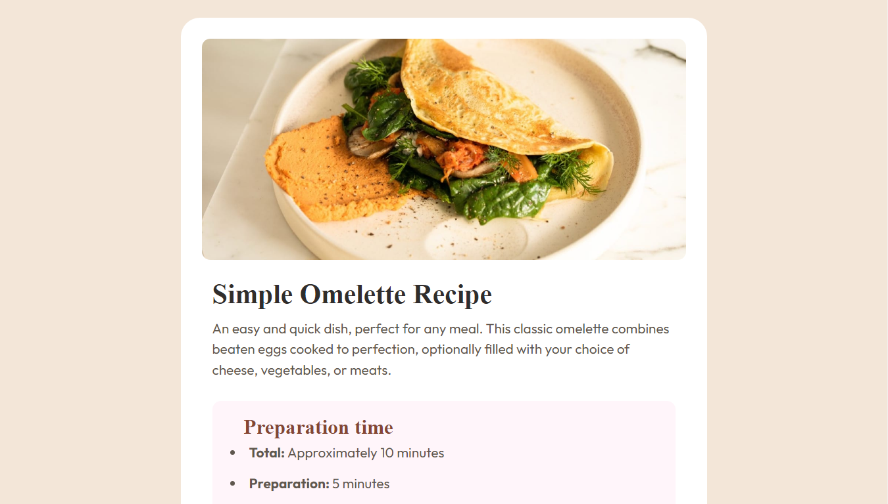

## Table of contents

- [The challenge](#the-challenge)
- [Screenshot](#screenshot)
- [Links](#links)
- [My process](#my-process)
  - [Built with](#built-with)
  - [What I learned](#what-i-learned)
  - [Continued development](#continued-development)
  - [Useful resources](#useful-resources)
- [Author](#author)

### The challenge{#the-challenge}

#RECIPE PAGE

### Screenshot

{#screenshot}

- Solution URL: [https://github.com/bestbrain06/recipe-page.git]{#links}

- Live Site URL: [https://bestbrain06.github.io/recipe-page/]

## My process{#my-process}

I used html, css to build this recipe page. I took in note of semantic Html, and writing a DRY code.

### Built with{#built-with}

- Semantic HTML5 markup
- CSS Varaibles
- Flexbox
- Mobile-first workflow

### What I learned{what-i-learned}

```html
<h1>Some HTML code I'm proud of</h1>

<table>
  <tr>
    <td></td>
    <td></td>
  </tr>
</table>
```

#### How to space out padding of a bullet point using the padding left properties.

```css
.Instructions__list-item {
  padding-left: 0.5rem;
}
```

### Continued development{continued-development}

I want to focus more on learning from the odin project. which will help me build my html, css and javascript skills.

### Useful resources{useful-resources}

- [https://www.theodinproject.com](The Odin Project) - This has helped me to learn the basis of html and css and how to use it to build single page application.

## Author{author}

- Name - [Ikechukwu Chidera]
- Frontend Mentor - [https://www.frontendmentor.io/profile/bestbrain06]
- Twitter - [https://twitter.com/BrainBest06]
